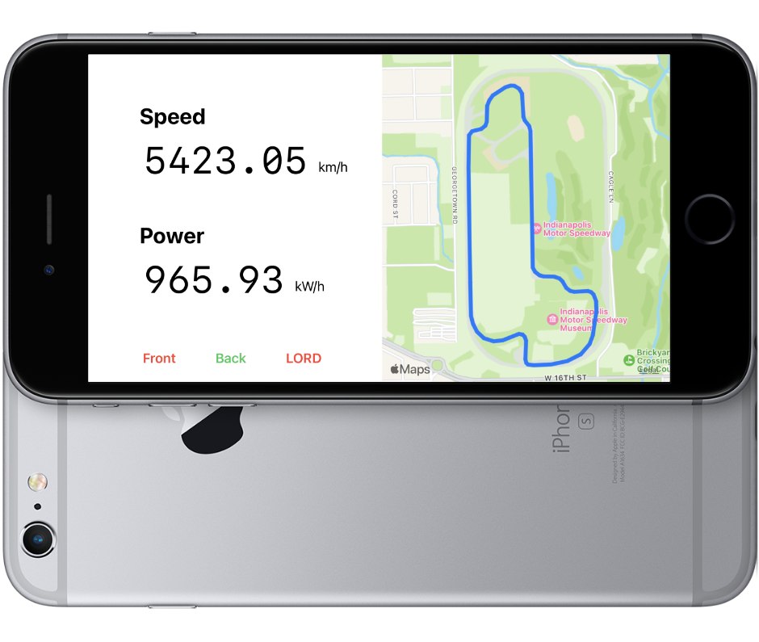
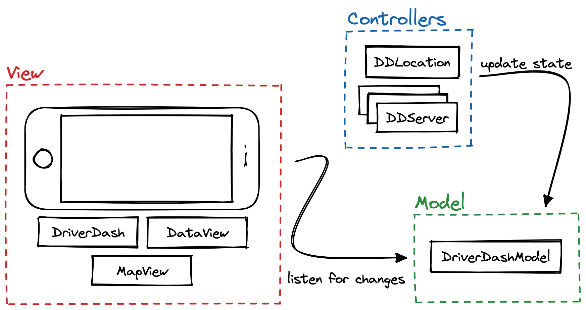

# Driver Dash 2023

_Jason Klein '26, Ari Kapelyan '25, Kalehiwot Dessalgne '25, Drew Wilenzick '26_

A quick solution to a driver dashboard for competition in less than two weeks (!) The core components of the dashboard are (1) live statistics from the DAQ that allow it to communicate current speed and power consumption to the driver and (2) the ability to archive all sorts of data like GPS for later analysis. We also implemented location tracking and a labelled map of the track.



Upon receiving properly-formatted TCP requests, the phone will make corresponding updates to the stats on the dashboard and will save the requests and their timestamps onto the device. Saved requests are stored in a format looking like

```jsonc
{
  "2023-03-26 23:22:02.709000": {
    "rpm": 300,
    "voltage": 24.1,
    "safety": 1
  },
  "2023-03-26 23:22:02.711000": {
    "rpm": 300,
    "voltage": 24.1,
    "safety": 1
  }
  // ...
}
```

You can find the saved files by opening the Files app on the phone and navigating to `On My iPhone > DriverDash`. There you should find two files, one called `back-daq.json` and one called `front-daq.json`. Note that, while the extension is `.json`, these aren't actually valid JSON files. the last comma needs to be replaced with a `}` in order for them to be valid JSON.

## Setup

_Since this is a native iOS app, it requires a Mac with XCode to build!_

1. Make sure that you have [cocoapods](https://guides.cocoapods.org/using/getting-started.html#installation) installed.
2. Navigate into the directory containing `Podfile` and run `pod install` from the terminal.
3. Run `open driver-dash-2023.xcworkspace` (not `.xcodeproj`)!

## Testing

_The server aspect of the app can only be tested when the app is run from a physical phone; it will not work in the Apple Simulator app!_

Assuming that the phone is connected to WiFi, you can find the phone's IP address by going to `Settings > WiFi > (i) next to connected network name > IP Address`, and the app will print to the console the port that the server will be running on (which should be `8080` because I hardcoded it). An IP address might look like `10.48.141.41`. When connected over cellular, the IP address is sometimes also aliased to `cev-telemetry-iphone.local`, which is quite convenient (`172.20.10.1` is also a good one to try). If that doesn't work, make sure that your laptop and the phone are connected to the same network and then run `arp -a` in a terminal. This will give you a bunch of IPs to try.

Due to constraints imposed by the ESP32s, we have switched from HTTP/WebSockets to raw TCP requests. The server on the phone is now a simple TCP server listening for requests in a `while true {}` loop on a different thread. Test the TCP server by running `test.py 10.48.141.41` (replacing the actual IP address there). If all goes well, the dashboard should update with some new values, the connected indicators at the bottom of the phone UI should turn green for a bit, and there should be new content in the `.json` files.

`test.py` works by making a connection to the front and back daq servers and sending random data. Call it with `--repetitions 5` to have it make five requests each time instead of one (works with any positive number).

## Structure

`DriverDash` (the root view), `DataView`, and `MapView` control the appearance of the iPhone app, laying out the values and numbers and indicators and displaying the data. To handle state and effects, the project uses the Model-View-Controller (MVC) architecture, with `DriverDash` as the view.

`DriverDashModel` is the model, and is responsible for storing the state for the app, such as the current speed and power values and the connection statuses. Every file within the `Controllers/` directory is a controller responsible for managing distinct aspects of the app. `DDLocation` gets location data from the phone to use as a fallback, and `DDServer` runs the TCP servers on separate threads and updates the model when they receive information. Overall, the structure looks like this:



There are also utility scripts `Coder` and `Serializer` in `Utilities/` which handle encoding/decoding JSON data and writing to files respectively. Because of the way that JSON parsing works in Swift, `Coder` will always have up-to-date typed structs `FrontPacket`, `BackPacket`, and `LordPacket` outlining which data it expects to see sent to each of the three servers.
